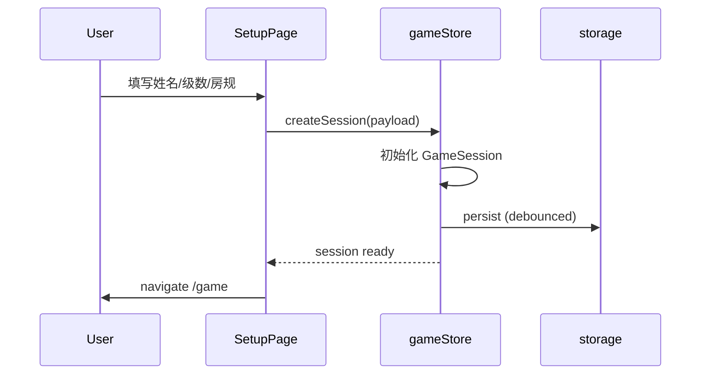
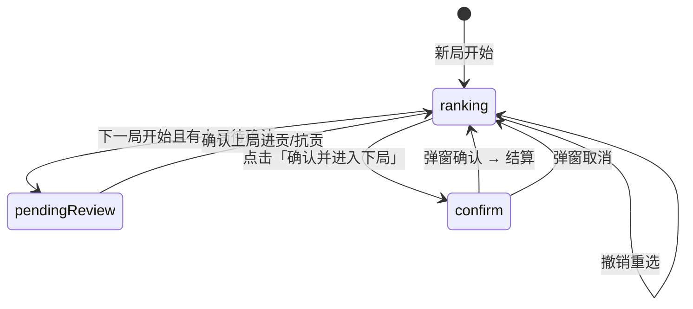
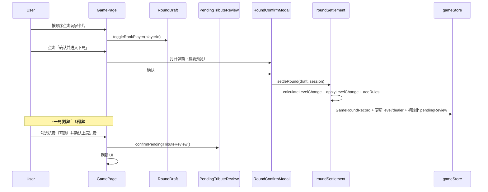
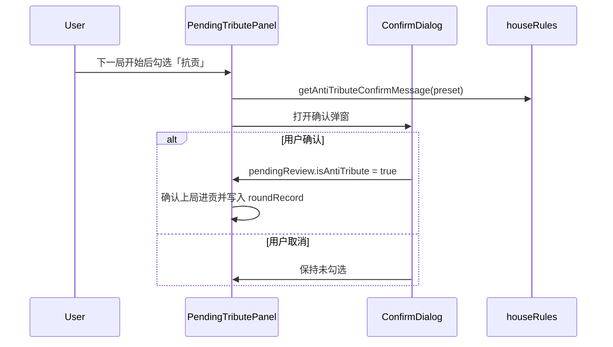
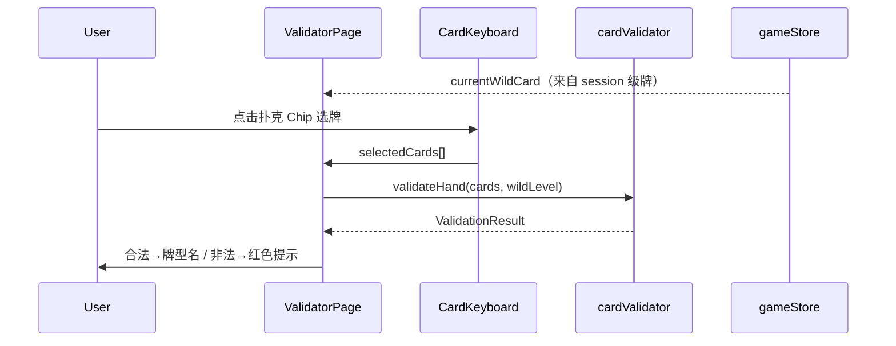
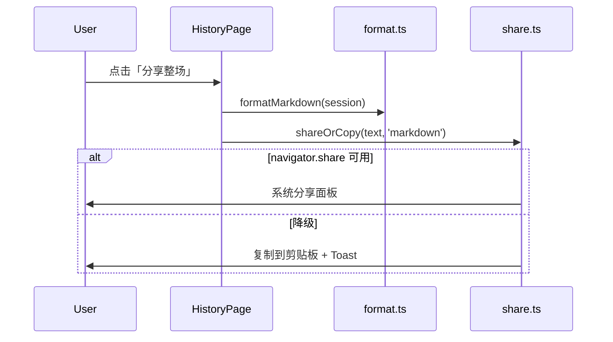

# 掼蛋大师 Web 端 — 软件设计文档 (SDD)

| 属性 | 内容 |
|------|------|
| 版本 | V1.1 |
| 文档状态 | 已确认 |
| 对应 PRD | [PRD-Web.md V1.2](./PRD-Web.md) |
| 对应 UI/UX | [UIUX-Web.md V1.0](./UIUX-Web.md) |
| 平台 | Web — React 19, TypeScript, Vite, Tailwind CSS v4 |
| 部署 | GitHub Pages — `boardgamevoice-commits.github.io/guandan_master_web/` |
| 最后更新 | 2026-07-03 |

---

## 1. 设计目标与约束

### 1.1 设计目标

| 目标 | 说明 |
|------|------|
| **可测试** | 算级、进贡、牌型校验全部在 `domain/` 纯函数实现，Vitest 覆盖率 ≥ 95% |
| **可维护** | 严格分层，UI 不含业务规则；新增房规/牌型只改 domain |
| **可恢复** | localStorage 持久化 + schema 版本迁移；每局级数快照，不依赖回溯 |
| **可部署** | 静态站点，零后端；GitHub Actions CI 绿即发布 |
| **对齐 iOS** | 升级/进贡/房规/数据结构语义与 iOS PRD V1.2 一致 |

### 1.2 硬约束

- 无用户账号、无网络请求（除静态资源）
- 全部数据存 `localStorage`，预估 < 1MB
- GitHub Pages 子路径部署：`base = /guandan_master_web/`
- MVP 不做牌型比大小，仅合法性校验
- 确认下局采用 **Modal 弹窗**，不用滑动/长按

### 1.3 PRD → SDD 映射

| PRD 模块 | SDD 章节 | 实现状态 |
|----------|----------|----------|
| F-001~F-007 开局设置 | §5.1, §6, §8 | 骨架 |
| F-010~F-020 记分主控台 | §5.2, §7, §9 | RankPicker 占位 |
| F-030~F-035 升级引擎 | §10.1 | ✅ `levelEngine.ts` |
| F-040~F-042 进贡引擎 | §10.2 | ✅ `tributeEngine.ts` |
| F-050~F-052 历史分享 | §5.6, §11 | Phase 1 最小集 |
| F-060~F-064 牌型校验 | §10.3 | 未实现 |
| 抗贡房规 | §10.4 | ✅ `houseRules.ts` |

---

## 2. 架构概览

### 2.1 分层模型

```
┌─────────────────────────────────────────────────────┐
│  Presentation (pages/, components/)                  │
│  React 组件、交互、动画、Modal                         │
└───────────────────────┬─────────────────────────────┘
                        │ hooks / store actions
┌───────────────────────▼─────────────────────────────┐
│  Application (stores/, hooks/)                      │
│  编排 domain 调用、持久化、路由守卫                     │
└───────────────────────┬─────────────────────────────┘
                        │ 纯函数调用
┌───────────────────────▼─────────────────────────────┐
│  Domain (domain/)                                   │
│  levelEngine, tributeEngine, houseRules, cardValidator│
│  ⚠ 零 React 依赖                                     │
└───────────────────────┬─────────────────────────────┘
                        │ 读写
┌───────────────────────▼─────────────────────────────┐
│  Data (utils/storage.ts)                            │
│  localStorage 序列化、schema 迁移、导出               │
└─────────────────────────────────────────────────────┘
```

### 2.2 模块职责

| 模块 | 职责 | 禁止 |
|------|------|------|
| `pages/` | 页面级布局、组合组件 | 直接写算级/校验逻辑 |
| `components/` | 可复用 UI（四方阵、Modal、ScoreCard） | 访问 localStorage |
| `stores/` | 全局会话状态、回合状态、actions | 导入 React 组件 |
| `hooks/` | 封装 store 选择器、副作用（persist 防抖） | 业务规则 |
| `domain/` | 所有游戏规则纯函数 | 任何浏览器 API |
| `utils/` | 存储、分享、格式化、ID 生成 | 游戏规则 |

### 2.3 依赖方向

```
pages → components, hooks, stores
stores → domain, utils/storage
domain → (无外部依赖，仅 types)
utils → types
```

**Feature 模块互不 import** — 仅在 `pages/` 和 `stores/` 层组合。

### 2.4 技术选型（最终确认）

| 领域 | 选型 | 理由 |
|------|------|------|
| UI | React 19 + Tailwind v4 | PRD 已定 |
| 状态 | **Zustand** | 轻量、支持 persist middleware、比 Context 更适合多 Tab 共享 |
| 路由 | React Router v7 | 深链接 + `basename` |
| 持久化 | Zustand persist → localStorage | 统一入口，减少手写序列化 |
| 测试 | Vitest + Testing Library | domain 单测 + 关键 UI 集成测 |
| ID | `crypto.randomUUID()` | 原生、无依赖 |
| 动画 | CSS `@keyframes` + SVG | 进贡箭头，无 Framer 依赖 |
| PWA | vite-plugin-pwa | Phase 3 |
| 运行时 | **Node.js 24 LTS** | 本地与 CI 统一；`.nvmrc` + `engines` |
| 部署 | GitHub Pages + Actions | checkout@v6, setup-node@v6, deploy-pages@v5（Node 24 action 运行时） |

---

## 3. 目录结构

### 3.1 目标结构（Phase 1 完成态）

```
src/
├── app/
│   └── App.tsx                    # 路由表
├── components/
│   ├── layout/
│   │   └── AppShell.tsx           # 顶栏 + 底 Tab
│   ├── ranking/
│   │   ├── RankPicker.tsx         # Phase 1：第1–4名下拉/点选
│   │   └── TributeTextPanel.tsx   # Phase 1：进贡文字指引
│   ├── square/                    # Phase 2：四方阵 + 箭头
│   │   ├── SquareBoard.tsx
│   │   └── TributeArrows.tsx
│   ├── scoreboard/
│   │   ├── RoundBanner.tsx        # 轮次横幅
│   │   ├── TeamScoreCard.tsx      # 计分卡片
│   │   └── TributePanel.tsx       # 进贡文案 + 抗贡勾选
│   ├── validator/
│   │   ├── CardKeyboard.tsx       # 横向选牌键盘
│   │   └── ValidationResult.tsx   # 校验结果展示
│   ├── history/
│   │   ├── RoundList.tsx
│   │   └── RoundDetailModal.tsx
│   ├── setup/
│   │   ├── PlayerSetupForm.tsx
│   │   └── HouseRulesPanel.tsx
│   └── shared/
│       ├── Modal.tsx
│       ├── ConfirmDialog.tsx
│       ├── RoundConfirmModal.tsx
│       ├── Toast.tsx              # 复制成功 / 错误提示
│       └── OnboardingOverlay.tsx
├── domain/
│   ├── levelEngine.ts             # ✅
│   ├── levelEngine.test.ts        # ✅
│   ├── tributeEngine.ts           # ✅
│   ├── tributeEngine.test.ts      # 待补
│   ├── houseRules.ts              # ✅
│   ├── houseRules.test.ts         # ✅
│   ├── aceRules.ts                # 过 A 判定（待建）
│   ├── aceRules.test.ts
│   ├── card/
│   │   ├── types.ts               # Card, Suit, Rank, HandType
│   │   ├── deck.ts                # 牌面常量、级牌推导
│   │   ├── patterns.ts            # 牌型模式定义
│   │   ├── wildcard.ts            # 逢人配匹配
│   │   ├── validator.ts           # validateHand(cards, level) → Result
│   │   └── validator.test.ts
│   └── roundSettlement.ts         # 单局结算编排（组合 level+tribute+ace）
├── hooks/
│   ├── useGameSession.ts
│   └── useRoundDraft.ts
├── pages/
│   ├── SetupPage.tsx
│   ├── GamePage.tsx
│   ├── HistoryPage.tsx
│   └── ValidatorPage.tsx
├── stores/
│   ├── gameStore.ts               # 会话 + 持久化
│   └── uiStore.ts                 # Modal 开关、引导状态
├── types/
│   ├── game.ts
│   ├── houseRules.ts              # AntiTributePresetId（类型层）
│   └── session.ts                 # wildCardLevel 等 helpers
├── utils/
│   ├── storage.ts                 # schema 版本、迁移
│   ├── share.ts                   # Markdown/文本/Web Share
│   ├── format.ts                  # 战报、玩家显示名
│   └── id.ts                      # UUID 封装
├── main.tsx
└── index.css
```

### 3.2 命名约定

| 类型 | 命名 | 示例 |
|------|------|------|
| 页面 | `*Page.tsx` | `GamePage` |
| 组件 | PascalCase | `SquareBoard` |
| domain 函数 | 动词开头 | `calculateLevelChange` |
| store | `use*Store` | `useGameStore` |
| 测试 | 同目录 `*.test.ts` | `levelEngine.test.ts` |

---

## 4. 数据模型

### 4.1 领域实体

```typescript
// src/types/game.ts — 已实现，补充说明

/** 级数 2–14，14 = A */
type Level = number;

/** 当前局级牌（逢人配）：与领先方级数对应 */
// currentWildCard = session 中领先方（台主方）的 level 数值

interface GameSession {
  id: string;
  players: Player[];
  ourLevel: Level;
  opponentLevel: Level;
  /** 当前打级方（升级方）→ RoundBanner、逢人配级牌 */
  playingTeam: Team;
  /** 本局先出牌方（台主）→ TeamScoreCard 高亮 */
  currentDealer: Team;
  houseRules: HouseRules;
  rounds: GameRoundRecord[];
  createdAt: string;
  updatedAt: string;
}

/** 逢人配级牌 = 打级方当前 level */
function currentWildCard(session: GameSession): number {
  return session.playingTeam === 'our'
    ? session.ourLevel
    : session.opponentLevel;
}

interface GameRoundRecord {
  id: string;
  roundNumber: number;
  date: string;                // ISO 8601
  ranks: string[];             // 长度 4，index=名次-1
  resultType: ResultType;
  isAntiTribute: boolean;
  currentWildCard: number;     // 该局级牌快照
  ourLevelSnapshot: number;    // 结算后
  opponentLevelSnapshot: number;
}

interface PendingTributeReview {
  roundId: string;
  isAntiTribute: boolean;
}
```

### 4.2 回合草稿（内存态，不持久化直到确认）

```typescript
// src/types/round.ts — 待建

interface RoundDraft {
  ranks: Array<string | null>; // 长度 4，index=名次-1
}
```

### 4.3 牌型领域模型

```typescript
// src/domain/card/types.ts — 待建

type Suit = 'spade' | 'heart' | 'diamond' | 'club' | 'joker';
type Rank =
  | 2 | 3 | 4 | 5 | 6 | 7 | 8 | 9 | 10
  | 11 | 12 | 13 | 14   // J Q K A
  | 'small_joker' | 'big_joker';

interface Card {
  suit: Suit;
  rank: Rank;
}

type HandType =
  | 'single'
  | 'pair'
  | 'triple'
  | 'full_house'      // 三带二
  | 'straight'        // 顺子 ≥5
  | 'pair_sequence'   // 木板（3 连对）
  | 'triple_sequence' // 钢板（2 三连张）
  | 'bomb'            // 炸弹 ≥4
  | 'flush_straight'  // 同花顺
  | 'four_jokers';    // 四大天王

interface ValidationResult {
  valid: boolean;
  handType?: HandType;
  displayName?: string;   // 如「钢板」「6 炸」
  error?: string;
}
```

### 4.4 localStorage Schema

```typescript
// src/utils/storage.ts

const STORAGE_KEY = 'guandan-master:v1';
const SCHEMA_VERSION = 2;

interface PersistedState {
  schemaVersion: number;
  session: GameSession | null;
  roundDraft: RoundDraft | null;
  ui: { hasSeenOnboarding: boolean };
  validator: { selectedCardIds: string[] };
}
```

**迁移策略：**

| 版本 | 变更 | 迁移函数 |
|------|------|----------|
| v1 | 初始 schema（`roundDraft` 含 `isAntiTribute`） | — |
| v2 | 新增 `pendingTributeReview`，`roundDraft` 仅保留 `ranks` | `migrateV1toV2()` |

读写流程：

```
load() → parse JSON → check schemaVersion → migrate if needed → hydrate store
save() → debounce 300ms → stringify → localStorage.setItem
```

---

## 5. 核心流程设计

### 5.1 开局设置流程



**默认玩家初始化：**

| 方位 | team | 默认 name |
|------|------|-----------|
| 东 | opponent | '' → 显示「东」 |
| 南 | our | '' |
| 西 | opponent | '' |
| 北 | our | '' |

### 5.2 单局记分流程（核心）





**名次录入规则：**

| 操作 | 行为 |
|------|------|
| 单击未排名玩家 | 赋予下一个名次（1→2→3→4） |
| 单击已排名玩家 | 取消该玩家名次，后续名次紧凑前移 |
| 长按未排名玩家（P1） | 与下一点击者同名次（平局） |
| 撤销 | 撤销上一步或清空重选 |

### 5.3 抗贡确认流程（下一局开始后）



### 5.4 下局确认弹窗（F-019）

`RoundConfirmModal` 展示数据由 **预览结算** 生成（不写入 store，直到确认）：

```typescript
interface RoundConfirmPreview {
  roundNumber: number;
  ranks: Array<{ player: Player; rank: number }>;
  resultLabel: string;       // 「南北队双下胜 (+3)」
  tributeSummary: string;    // 进贡文案（抗贡在下一局确认）
  levelPreview: {
    our: { from: number; to: number };
    opponent: { from: number; to: number };
  };
  nextDealer: Team;
}
```

预览调用：`previewRoundSettlement(session, draft)` → 纯函数，位于 `domain/roundSettlement.ts`。

### 5.5 牌型校验流程



校验器 **只读** session 级牌，不修改记分状态。

### 5.6 历史与分享（Phase 1 最小集）

- `HistoryPage` + `RoundList` + `RoundDetailModal`
- `formatPlainText(session)` → 剪贴板 + `Toast`「已复制」
- Markdown 精美排版 → Phase 2



---

## 6. 状态管理

### 6.1 gameStore（Zustand + persist）

```typescript
interface GameState {
  session: GameSession | null;
  roundDraft: RoundDraft | null;

  // Actions
  createSession: (input: SetupInput) => void;
  updateSetup: (partial: Partial<SetupInput>) => void;
  resetSession: () => void;

  toggleRankPlayer: (playerId: string) => void;
  undoLastRank: () => void;
  setPendingAntiTribute: (value: boolean) => void;
  confirmPendingTributeReview: () => void;
  confirmRound: () => GameRoundRecord;   // 弹窗确认后调用
  deleteRound: (roundId: string) => void;
  clearHistory: () => void;
}

// Selectors（派生）
// - currentRoundNumber = rounds.length + 1
// - wildCardLevel = currentDealer 对应 team 的 level
// - canConfirmRound = ranks.length === 4 && !pendingTributeReview
```

### 6.2 uiStore（不持久化或轻量持久化）

```typescript
interface UIState {
  modals: {
    roundConfirm: boolean;
    antiTributeConfirm: boolean;
    roundDetail: string | null;  // roundId
  };
  hasSeenOnboarding: boolean;

  openRoundConfirm: () => void;
  closeRoundConfirm: () => void;
  // ...
}
```

### 6.3 页面 ↔ Store 映射

| 页面 | 读取 | 写入 |
|------|------|------|
| SetupPage | `session`, `houseRules` | `createSession`, `updateSetup` |
| GamePage | `session`, `roundDraft`, selectors | `toggleRankPlayer`, `setPendingAntiTribute`, `confirmPendingTributeReview`, `confirmRound` |
| ValidatorPage | `wildCardLevel` | 本地 `selectedCards`（uiStore 或 page state） |
| HistoryPage | `session.rounds` | `deleteRound`, `clearHistory` |

---

## 7. 组件设计

### 7.1 SquareBoard（四方阵）

```
        [北 our]
[西 opp]  中心   [东 opp]
        [南 our]
```

| Prop | 类型 | 说明 |
|------|------|------|
| `players` | `Player[]` | 按方位排列 |
| `rankMap` | `Record<string, number>` | 已录入名次 |
| `onPlayerClick` | `(id) => void` | 单击录入 |
| `onPlayerLongPress` | `(id) => void` | 长按平局 |
| `disabled` | `boolean` | tribute/confirm 阶段禁改 |

**布局：** CSS Grid 3×3，四边中点放 `PlayerNode`，中心放 `TributeArrows`。

### 7.2 TributeArrows

| Prop | 类型 |
|------|------|
| `relations` | `TributeRelation[]` |
| `playerPositions` | `Map<string, DOMRect>` 或预计算坐标 |

**实现：** SVG overlay，`path` 动画 `stroke-dashoffset`；`prefers-reduced-motion` 时静态显示。

### 7.3 Modal 体系

| 组件 | 用途 | 触发 |
|------|------|------|
| `Modal` | 遮罩 + 居中容器 + focus trap | 基础壳 |
| `ConfirmDialog` | 标题 + 文案 + 取消/确认 | 抗贡、删除 |
| `RoundConfirmModal` | 摘要 + 级数预览 + 确认下局 | F-019 |

**无障碍：** `role="dialog"`, `aria-modal="true"`, Esc 关闭, 焦点还原。

### 7.4 CardKeyboard

- 两副牌 108 张逻辑张（UI 按「选牌」简化：52×2 + 王×2，同花色点数 Chip）
- 横向 `overflow-x: auto` 滚动
- 已选牌高亮；再次点击取消
- 「清空」按钮

---

## 8. 路由设计

```typescript
// src/app/App.tsx
// basename 来自 import.meta.env.BASE_URL（GitHub Pages 兼容）

/           → Navigate /game
/game       → GamePage（无 session 时 redirect /setup）
/setup      → SetupPage
/validator  → ValidatorPage
/history    → HistoryPage
```

**路由守卫（`GamePage`）：**

```typescript
if (!session) return <Navigate to="/setup" replace />;
```

---

## 9. Domain 层详细设计

### 9.1 levelEngine（✅ 已实现）

| 函数 | 输入 | 输出 |
|------|------|------|
| `calculateLevelChange` | ranks[4], players | `LevelChange` |
| `applyLevelChange` | levels, change | 新 levels（cap 14） |

**待扩展 → `aceRules.ts`：**

```typescript
interface AceRuleResult {
  passed: boolean;           // 是否过 A 胜利
  stayAtAce: boolean;        // 打 A 失败留 A
  fallbackLevel?: number;    // 如连续失败退回 2
}

function evaluateAceRound(
  change: LevelChange,
  ranks: string[],
  players: Player[],
  houseRules: HouseRules,
  teamLevels: { our: number; opponent: number },
): AceRuleResult;
```

**过 A 默认规则（国标）：**

| 条件 | 结果 |
|------|------|
| 己方 A 级 + 头游非己方 | 不过 A，留 A |
| 己方 A 级 + 头游己方 + 二游/三游/下游含队友末位 | 按房规（F-005） |
| 房规 `aceRequiresDoubleDown` + 打 A 非双下 | 不过 A |
| 满足过 A 条件 | `passed: true`，本场结束（可选 UI 提示） |

### 9.2 tributeEngine（✅ 已实现）

| 函数 | 说明 |
|------|------|
| `calculateTribute` | 进贡关系 + 文案 |
| `getAntiTributeMessage` | 抗贡成功提示 |

### 9.3 houseRules（✅ 已实现）

抗贡预设仅影响 **UI 文案与确认**，实际抗贡由用户手动标记（线下已发生），domain 不验证物理牌面。

### 9.4 cardValidator（待实现 — Phase 1 重点）

#### 9.4.1 级牌与逢人配

```typescript
/** 给定当前级数，返回级牌 rank 数值 */
function levelToRank(level: Level): Rank { /* 2–14 */ }

/** 红心级牌为逢人配 wildcard */
function isWildcard(card: Card, wildLevel: Level): boolean {
  return card.suit === 'heart' && card.rank === levelToRank(wildLevel);
}
```

#### 9.4.2 校验流水线

```
validateHand(cards, wildLevel):
  1. if empty → invalid
  2. if 四大天王(4 jokers) → valid, four_jokers
  3. partition wildcards vs natural cards
  4. try matchers in priority order:
     bomb → flush_straight → triple_sequence → pair_sequence
     → straight → full_house → triple → pair → single
  5. first match wins → valid + displayName
  6. no match → invalid
```

#### 9.4.3 牌型匹配器（wildcard 回溯）

```typescript
type Matcher = (cards: Card[], wildCount: number, wildLevel: Level) => MatchResult | null;

interface MatchResult {
  handType: HandType;
  displayName: string;
}
```

| 牌型 | 张数 | 匹配要点 |
|------|------|----------|
| 单张 | 1 | 任意 1 张 |
| 对子 | 2 | 同 rank 或 1 wild |
| 三同张 | 3 | 同 rank 或 wild 补 |
| 三带二 | 5 | 3+2，wild 分配两组 |
| 顺子 | ≥5 | 连续 rank，不含 2 和王；wild 填缺口 |
| 木板 | 6 | 3 连续对子 |
| 钢板 | 6 | 2 连续三同张 |
| 炸弹 | ≥4 | 同 rank，wild 补 |
| 同花顺 | ≥5 | 同 suit 顺子 |
| 四大天王 | 4 | 2 大 2 小 joker |

**逢人配约束：**

- 逢人配 **不能** 单独构成炸弹（若 wild 单独成组则尝试其他分配）
- 顺子中逢人配代替缺失点数
- 同花顺需同花色（逢人配继承目标花色）

#### 9.4.4 回溯算法伪代码

```typescript
function matchWithWildcards(
  natural: Card[],
  wildCount: number,
  predicate: (group: Card[]) => boolean,
  groupSize: number,
  groupCount: number,
): boolean {
  // 将 wild 分配到 groupCount 组，每组 groupSize 张
  // DFS + 剪枝：按 rank 排序后限制搜索深度
  // 目标：natural + assigned wilds 满足 predicate
}
```

**性能预算：** 单次校验 < 16ms（≤10 张选牌，wild ≤4）。

### 9.5 roundSettlement（待建 — 编排层）

```typescript
function settleRound(
  session: GameSession,
  draft: RoundDraft,
): { record: GameRoundRecord; nextSession: Partial<GameSession> };

function previewRoundSettlement(
  session: GameSession,
  draft: RoundDraft,
): RoundConfirmPreview;
```

内部调用顺序：

```
calculateLevelChange
→ applyLevelChange
→ evaluateAceRound
→ 确定 nextDealer（抗贡/正常：上局头游方领出 → 下局台主）
→ 构建 GameRoundRecord（含 snapshots）
```

**台主 / 打级 / 领出 — 定稿规则：**

| 概念 | 字段 | 更新时机 |
|------|------|----------|
| 打级方 | `playingTeam` | 胜方续打级；初始=首局台主方 |
| 先出牌方 | `currentDealer` | = `TributeResult.leadPlayerId` 所属 team |
| 逢人配 | `wildCardLevel(playingTeam, …)` | 每局结算后随 playingTeam level 变 |

| 场景 | 下局 `currentDealer` | 下局 `playingTeam` |
|------|----------------------|---------------------|
| 正常进贡 | 单贡由下游领出；双下由贡牌大者领出（同点为上游下家） | 下游方 |
| 抗贡 | 头游领出 | 胜方 |
| 过 A 胜利 | — | 本场结束，UI 庆祝 Banner |

实现见 `domain/roundSettlement.ts` + `types/session.ts#wildCardLevel`。

---

## 10. 存储与导出

### 10.1 持久化范围

| 数据 | 持久化 | 键 |
|------|--------|-----|
| GameSession | ✅ | `guandan-master:v1` |
| hasSeenOnboarding | ✅ | 同上 |
| RoundDraft | ✅ | 与 session 同键持久化，防刷新丢失 |
| Validator 选牌 | ⚠ 可选 | 同上 ui.validator |

### 10.2 数据删除

| 操作 | 实现 |
|------|------|
| 删除单局 | `rounds.filter(r => r.id !== id)` |
| 清空历史 | `rounds = []` |
| 新对局 | `createSession()` 覆盖 session |
| 全部清除 | `localStorage.removeItem(STORAGE_KEY)` |

Setup 页提供「新对局」二次确认，防误触。

### 10.3 导出（Phase 2）

```typescript
// utils/share.ts
function formatMarkdown(session: GameSession): string;
function formatPlainText(session: GameSession): string;
async function shareOrCopy(text: string, title: string): Promise<'shared' | 'copied'>;
```

---

## 11. 错误处理

| 场景 | 用户提示 | 技术处理 |
|------|----------|----------|
| 排名无效（同队不可能组合） | 「此排名不符合规则」 | `calculateLevelChange` throw → catch |
| localStorage 不可用 | 顶部警告条 + 内存态降级 | try/catch + `storageAvailable` 检测 |
| 多 Tab 同时打开 | 后写覆盖 | `storage` 事件同步 或 UI 提示「请勿多 Tab」 |
| SPA 深链 404 | GitHub Pages | `build:pages` 复制 `404.html` |
| JSON 解析失败 | 静默重置 | migrate / 恢复默认 |
| 校验空牌 | 「请选择至少一张牌」 | validator 前置检查 |
| 无 session 进 /game | 重定向 /setup | 路由守卫 |

**原则：** domain 层 throw `DomainError`（自定义类）；store 捕获转用户文案。

---

## 12. 测试策略

### 12.1 分层覆盖

| 层 | 工具 | 目标 | 重点 |
|----|------|------|------|
| domain | Vitest | ≥ 95% | 算级、进贡、过 A、牌型 |
| stores | Vitest | 核心 actions | confirmRound, persist |
| components | Testing Library | P0 交互 | SquareBoard 录入、Modal 确认 |
| E2E | 选手动 / 可选 Playwright | 主路径 | Phase 3 |

### 12.2 domain 测试矩阵

**levelEngine（✅ 部分完成，待补）：**

| 用例 | 排名模式 | 期望 |
|------|----------|------|
| L-01 | 1、2 同队 | 双下 +3 |
| L-02 | 1、3 同队 | 单下 +2 |
| L-03 | 1、4 同队 | 单下 +1 |
| L-04 | 13+3 | cap 14 |
| L-05 | 无效组合 | throw |

**tributeEngine（待补）：**

| 用例 | 场景 | 期望 |
|------|------|------|
| T-01 | 单下 | 1 条箭头 4→1 |
| T-02 | 双下 | 2 条箭头 3→1, 4→2 |
| T-03 | 抗贡 | relations=[] |

**cardValidator（待建 ≥ 15 用例）：**

| 用例 | 描述 |
|------|------|
| C-01 | 单张 8 |
| C-02 | 对子 + 1 wild |
| C-03 | 顺子 5 张含 wild 填 6 |
| C-04 | 钢板 222333 |
| C-05 | 木板 334455 |
| C-06 | 4 炸 |
| C-07 | 同花顺 |
| C-08 | 四大天王 |
| C-09 | 逢人配不当炸弹 |
| C-10 | 非法杂牌 |
| C-11~15 | 边界 wild 数量 |

### 12.3 CI

```yaml
# 已在 .github/workflows/deploy.yml
npm ci → npm run test:run → npm run build:pages → deploy
```

测试失败 **阻断部署**。

---

## 13. 性能与资源

| 项 | 预算 | 手段 |
|----|------|------|
| 首屏 JS | < 300KB gzip | 路由懒加载（Phase 3） |
| 算级/校验 | < 16ms | 纯函数、无 DOM |
| 动画 | 60fps | CSS transform/opacity；reduced-motion 降级 |
| 持久化 | debounce 300ms | 避免频繁 write |
| 四方阵 | 无 re-render 风暴 | `PlayerNode` memo + 稳定 callback |

---

## 14. 安全与隐私

- 无后端 → 无 SQL/XSS 服务端风险
- 用户输入（姓名）仅 localStorage，`textContent` 渲染防 XSS
- 无第三方脚本、无 analytics
- 分享仅客户端生成文本，不上传

---

## 15. 实施计划

### Phase 1 — MVP（3 周）

| 周 | 交付 | 文件 |
|----|------|------|
| W1 | Store + Setup + 持久化（含 roundDraft） | `gameStore.ts`, `storage.ts` |
| W1 | **RankPicker** + 撤销 | `RankPicker`, `GamePage` |
| W2 | 进贡文字 + 抗贡 + 下局弹窗 | `TributeTextPanel`, `roundSettlement.ts` |
| W2 | **历史列表 + 纯文本复制** | `HistoryPage`, `format.ts`, `Toast` |
| W3 | 牌型校验器 | `domain/card/*` |
| W3 | 单测 + CI | domain ≥ 95% |

### Phase 2 — 体验增强（1 周）

- 四方阵 `SquareBoard` + `TributeArrows`
- Markdown 战报、PWA precache

### Phase 3 — 体验（1 周）

- PWA、`OnboardingOverlay`、a11y 审计、懒加载

---

## 16. 开放问题

- [x] 台主 / 打级 / 级牌：`playingTeam` + `currentDealer`（§9.5）
- [x] Phase 1 含历史 + 纯文本复制
- [x] Phase 1 名次选择器，四方阵 Phase 2
- [ ] 过 A 胜利 UI：Banner +「本场结束」

---

## 附录 A：牌型显示名称映射

| HandType | displayName 示例 |
|----------|------------------|
| single | 单张 |
| pair | 对子 |
| triple | 三同张 |
| full_house | 三带二 |
| straight | 顺子 |
| pair_sequence | 木板 |
| triple_sequence | 钢板 |
| bomb | N 炸（N=张数） |
| flush_straight | 同花顺 |
| four_jokers | 四大天王 |

---

## 附录 B：GitHub Pages 部署清单

| 项 | 配置 |
|----|------|
| Node.js | **24 LTS**（`.nvmrc` + `engines`） |
| Vite base | `/guandan_master_web/` |
| SPA fallback | `cp dist/index.html dist/404.html` |
| Router basename | `import.meta.env.BASE_URL` |
| 构建 | `npm run build:pages` |
| CI Actions | `checkout@v6`, `setup-node@v6`, `upload-pages-artifact@v4`, `deploy-pages@v5` |
| Pages Source | GitHub Actions |

---

## 附录 C：与 iOS 对齐检查表

| 模块 | Web 文件 | iOS 对应 | 状态 |
|------|----------|----------|------|
| 升级 | levelEngine.ts | LevelViewModel | ✅ |
| 进贡 | tributeEngine.ts | TributeViewModel | ✅ |
| 房规 | houseRules.ts | HouseRules | ✅ |
| 过 A | aceRules.ts | LevelViewModel | 待建 |
| 牌型 | card/validator.ts | CardValidator | 待建 |
| 持久化 | storage.ts | SwiftData | 待建 |
| 持久化 | share.ts | ShareLink | Phase 1 纯文本 |
